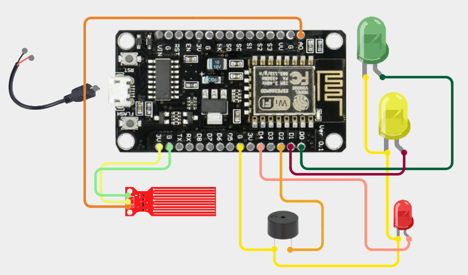

# LPG Supervision System using ESP8266

This project is a NodeMCU-based project which efficiently presents the hidden LPG level inside the LPG-cylinder. It uses sensor to detect the level of the liquid and light up LEDs based on the data also shows data in a local website.

---

## 🚀 Features

- Detect the level of the LPG inside the cylinder
- Show the amount of gas used and remaining on a website
- Show different color lighting to demonstrate the remaining amount
- Notifying the user by making a sound using a buzzer for critical cases

---

## 🛠️ Hardware Components

| Component             | Quantity | Description                          |
|----------------------|----------|--------------------------------------|
| ESP8266              | 1        | Microcontroller & Local web host     |
| Water Level Sensor   | 1        | For detecting LPG levels             |
| Buzzer               | 1        | Make sound                           |
| LEDs                 | 3        | For visual indicators                |
| Jumper Wires         | As needed| For connections                      |
| Power Supply         | 1        | Suitable for ESP8266                 |

---

## ⚙️ Circuit Diagram

---

## 📦 Installation & Setup

1. Open the Arduino IDE and go to File > Preferences. In the "Additional Boards Manager URLs" field, paste the following URL: http://arduino.esp8266.com/stable/package_esp8266com_index.json.
2. Go to Tools > Board > Boards Manager. Search for "ESP8266" and install the package titled "ESP8266 by ESP8266 Community".
3. Connect water level sensors to ESP8266 pins according to the circuit diagram.
4. Wire the LEDs and buzzer according to the circuit diagram.
5. Upload the Arduino sketch using the Arduino IDE.
6. Power the system and put the sensor in liquid.
7. Connect to the wifi named "Lab Detection Lab" with password "12345678".
8. Go to any browser and see the reading in the website hosted in 192.168.1.1

---

## 🧠 How It Works

- Sensors detect water levels at different heights.
- This measured data send to ESP8266 and ESP8266 show this data by the hosted website.
- LEDs indicate system status (e.g., Normal, Low, Critical).

---

## 🧑‍🔧 Author

Created by Md. Ridowan Ahmed  
free to reach out for collaboration or feedback!

---

## 🙏 Acknowledgments

- Thanks to the open-source community for providing the necessary libraries and resources for Arduino programming.
- Inspired by similar projects and ideas available online, which helped shape and refine this system.

